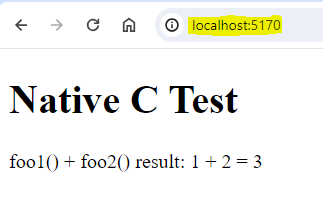

# blazor_webassembly_native_dependencies

Use native dependencies with Blazor WebAssembly by statically linking them into the .NET WebAssembly runtime ```dotnet.wasm``` using the .NET WebAssembly build tools[^1].

The .NET WebAssembly build tools are based on [Emscripten](https://emscripten.org/), a compiler toolchain for the web platform.

## Background

In theory, any C/C++ code or code previously compiled using Emscripten can be used as a native dependency with Blazor WebAssembly, e.g.:

* Source files (.c/.cpp)
* Object files (.o)
* Archive files (.a)
* Bitcode (.bc)
* Standalone WebAssembly modules (.wasm)

**Note:** Native dependencies may need to be built using the same version of Emscripten used to build the .NET WebAssembly runtime.

## Purpose

Show how to leverage existing C source code inside a Blazor WebAssembly application.

## Main Project Files

1. ```foo1.c``` and ```foo2.c``` - Native dependencies (C source code files)
2. ```BlazorWasmNativeDependencies.csproj``` - Blazor WebAssembly project file
3. ```Pages/Index.razor``` - Razor page file

## How to use Native Dependencies[^2]

***Note:*** You can skip over steps 1 through 4 if you already have a copy of the code or repo.

1. Create a new Blazor WebAssembly project using the ```blazorwasm-empty``` template.

```command
>dotnet new blazorwasm-empty -o BlazorWasmNativeDependencies
```

2. Add the C source code files ```foo1.c``` and ```foo2.c``` to the project.

3. Add a ```NativeFileReference``` for the each of the C source code files in the app's project file:

```xml
<ItemGroup>
  <NativeFileReference Include="foo1.c" />
  <NativeFileReference Include="foo2.c" />
</ItemGroup>
```

4. In the ```Pages/Index.Razor``` component, replace existing lines with the ones below[^3]:

```razor
@page "/"

@using System.Runtime.InteropServices

<h1>Native C Test</h1>

<p>
    foo1() + foo2() result: @foo1() + @foo2() = @(foo1() + foo2())
</p>

@code {
    [DllImport("foo1")]
    static extern int foo1();

    [DllImport("foo2")]
    static extern int foo2();
}
```

5. Build the Blazor WebAssembly app:

```command
>dotnet build
```

6. Run the Blazor WebAssembly app in a Web Browser:

```command
>dotnet run
```

### Web Browser Output



## References:

[^1]: [Tooling for ASP.NET Core Blazor](https://learn.microsoft.com/en-us/aspnet/core/blazor/tooling?view=aspnetcore-8.0)

[^2]: [ASP.NET Core Blazor WebAssembly native dependencies](https://learn.microsoft.com/en-us/aspnet/core/blazor/webassembly-native-dependencies?view=aspnetcore-8.0)

[^3]: [Razor syntax reference for ASP.NET Core](https://learn.microsoft.com/en-us/aspnet/core/mvc/views/razor?view=aspnetcore-8.0)
